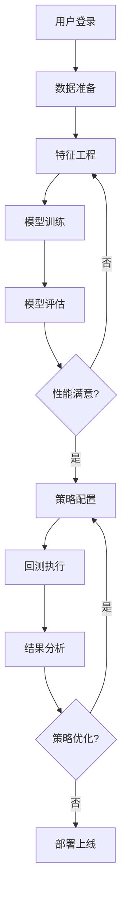

# Qlib可视化平台完整设计方案

## 一、项目概述

### 1.1 项目定位
构建一个**一键部署、开箱即用**的Qlib可视化操作平台，让用户通过Web界面即可完成量化投资的全流程操作，无需编写代码。

### 1.2 核心设计原则
- **零配置**: 开箱即用，自动配置所有依赖
- **实时交互**: 用户操作实时转换为Qlib命令并执行
- **状态同步**: 界面与Qlib执行状态实时同步
- **资源隔离**: 多用户任务隔离，互不干扰

### 1.3 技术选型（简化版）
- **全栈框架**: Next.js 14 (同时处理前端和API)
- **Golang后端**: Gin框架 (轻量级，与Qlib直接集成)
- **数据库**: Mysql
- **任务队列**: Celery + Redis (任务调度)

## 二、系统架构设计

### 2.1 简化的三层架构

```
┌─────────────────────────────────────────────────┐
│           Web界面 (Next.js SSR)                 │
│   静态页面 + React组件 + 实时WebSocket          │
└─────────────────────────────────────────────────┘
                        ↕ HTTP/WS
┌─────────────────────────────────────────────────┐
│         API服务层 (FastAPI)                     │
│   路由处理 → 参数验证 → Qlib调用封装            │
└─────────────────────────────────────────────────┘
                        ↕ Python
┌─────────────────────────────────────────────────┐
│         Qlib执行层                              │
│   Qlib Core + 任务队列 + 结果缓存              │
└─────────────────────────────────────────────────┘
```

### 2.2 部署架构（Docker Compose）

```yaml
# docker-compose.yml - 一键部署配置
version: '3.8'

services:
  # 前端 + API 一体化服务
  app:
    build: .
    ports:
      - "3000:3000"  # Next.js
      - "8000:8000"  # FastAPI
    volumes:
      - ./data:/app/data  # 数据持久化
      - ./models:/app/models  # 模型存储
      - ./results:/app/results  # 结果存储
    environment:
      - QLIB_DATA_PATH=/app/data/qlib_data
      - DATABASE_URL=sqlite:///app/data/qlib.db
    depends_on:
      - redis

  # Redis - 任务队列和缓存
  redis:
    image: redis:alpine
    volumes:
      - redis_data:/data

  # Celery Worker - 异步任务处理
  worker:
    build: .
    command: celery -A app.tasks worker --loglevel=info
    volumes:
      - ./data:/app/data
      - ./models:/app/models
    depends_on:
      - redis

volumes:
  redis_data:
```

### 2.3 项目目录结构

```
qlib-platform/
├── docker-compose.yml          # 一键部署配置
├── Dockerfile                   # 统一镜像
├── README.md                    # 快速开始指南
├── .env.example                 # 环境变量示例
│
├── frontend/                    # Next.js前端
│   ├── pages/                   # 页面路由
│   ├── components/              # React组件
│   ├── lib/                     # 工具函数
│   └── public/                  # 静态资源
│
├── backend/                     # Python后端
│   ├── main.py                  # FastAPI入口
│   ├── api/                     # API路由
│   ├── qlib_integration/        # Qlib集成层
│   ├── tasks/                   # Celery任务
│   ├── models/                  # 数据模型
│   └── utils/                   # 工具函数
│
├── scripts/                     # 脚本工具
│   ├── init_data.py            # 初始化数据
│   ├── download_data.py        # 下载市场数据
│   └── setup.sh                # 环境设置
│
└── data/                       # 数据目录
    ├── qlib_data/              # Qlib数据
    ├── user_data/              # 用户数据
    └── cache/                  # 缓存数据
```

## 三、Qlib集成层设计

### 3.1 Qlib封装器（核心设计）

```python
# backend/qlib_integration/qlib_wrapper.py

import qlib
from qlib import config as qlib_config
from typing import Dict, Any, Optional
import json
import pickle
from pathlib import Path

class QlibWrapper:
    """Qlib操作封装器，将用户界面操作转换为Qlib调用"""
    
    def __init__(self, data_path: str):
        self.data_path = data_path
        self.initialize_qlib()
        
    def initialize_qlib(self):
        """初始化Qlib配置"""
        qlib_config.set_data_path(self.data_path)
        qlib.init(
            provider_uri=self.data_path,
            region="cn",
            kernels=1  # 单机模式
        )
    
    def prepare_data(self, params: Dict[str, Any]) -> Dict[str, Any]:
        """数据准备 - 从界面参数到Qlib数据"""
        # 界面参数示例:
        # {
        #     "dataset": "csi300",
        #     "start_date": "2020-01-01",
        #     "end_date": "2023-12-31",
        #     "features": ["open", "close", "volume"],
        #     "label": "Ref($close, -1) / $close - 1"
        # }
        
        from qlib.data import D
        from qlib.data.dataset import DatasetH
        from qlib.data.dataset.handler import DataHandlerLP
        
        # 构建特征表达式
        fields = self._build_feature_expressions(params["features"])
        
        # 创建数据处理器
        handler_config = {
            "start_time": params["start_date"],
            "end_time": params["end_date"],
            "fit_start_time": params["start_date"],
            "fit_end_time": params["end_date"],
            "instruments": params["dataset"],
            "infer_processors": [
                {"class": "RobustZScoreNorm", "fields_group": "feature"},
                {"class": "Fillna", "fields_group": "feature"},
            ],
            "learn_processors": [
                {"class": "DropnaLabel"},
                {"class": "CSRankNorm", "fields_group": "label"},
            ],
            "label": [params["label"]]
        }
        
        handler = DataHandlerLP(**handler_config)
        dataset = DatasetH(handler)
        
        return {
            "status": "success",
            "dataset_id": self._save_dataset(dataset),
            "info": {
                "samples": len(dataset),
                "features": len(fields),
                "date_range": f"{params['start_date']} to {params['end_date']}"
            }
        }
    
    def train_model(self, params: Dict[str, Any]) -> Dict[str, Any]:
        """模型训练 - 从界面参数到Qlib模型训练"""
        # 界面参数示例:
        # {
        #     "model_type": "lightgbm",
        #     "dataset_id": "dataset_123",
        #     "model_params": {
        #         "learning_rate": 0.01,
        #         "num_leaves": 31,
        #         "n_estimators": 100
        #     },
        #     "split_method": "time_series"
        # }
        
        # 加载数据集
        dataset = self._load_dataset(params["dataset_id"])
        
        # 选择模型
        model = self._create_model(params["model_type"], params["model_params"])
        
        # 训练模型
        from qlib.model.trainer import task_train
        
        task_config = {
            "model": model,
            "dataset": dataset,
            "evals": [("train", "train"), ("valid", "valid")]
        }
        
        # 执行训练
        trained_model = task_train(task_config)
        
        # 保存模型
        model_id = self._save_model(trained_model)
        
        return {
            "status": "success",
            "model_id": model_id,
            "metrics": self._evaluate_model(trained_model, dataset)
        }
    
    def run_backtest(self, params: Dict[str, Any]) -> Dict[str, Any]:
        """策略回测 - 从界面参数到Qlib回测"""
        # 界面参数示例:
        # {
        #     "strategy_type": "top_k_drop",
        #     "model_id": "model_123",
        #     "dataset_id": "dataset_123",
        #     "strategy_params": {
        #         "topk": 30,
        #         "n_drop": 5,
        #         "hold_thresh": 0
        #     },
        #     "backtest_params": {
        #         "start_date": "2022-01-01",
        #         "end_date": "2023-12-31",
        #         "account": 1000000,
        #         "benchmark": "SH000300"
        #     }
        # }
        
        from qlib.contrib.strategy import TopkDropoutStrategy
        from qlib.contrib.evaluate import backtest_daily
        from qlib.contrib.report import analysis_position
        
        # 加载模型和数据
        model = self._load_model(params["model_id"])
        dataset = self._load_dataset(params["dataset_id"])
        
        # 创建策略
        strategy = TopkDropoutStrategy(
            model=model,
            dataset=dataset,
            **params["strategy_params"]
        )
        
        # 执行回测
        portfolio_metrics, positions = backtest_daily(
            strategy=strategy,
            **params["backtest_params"]
        )
        
        # 分析结果
        report = analysis_position.report_graph(positions)
        
        return {
            "status": "success",
            "backtest_id": self._save_backtest_result(portfolio_metrics, positions),
            "metrics": {
                "annual_return": portfolio_metrics["annual_return"],
                "sharpe_ratio": portfolio_metrics["sharpe_ratio"],
                "max_drawdown": portfolio_metrics["max_drawdown"],
                "win_rate": portfolio_metrics["win_rate"]
            },
            "report_url": f"/api/report/{backtest_id}"
        }
    
    def _build_feature_expressions(self, features: list) -> list:
        """构建Qlib特征表达式"""
        expressions = []
        for feature in features:
            if feature in ["open", "close", "high", "low", "volume"]:
                expressions.append(f"${feature}")
            else:
                # 技术指标
                expressions.append(self._parse_technical_indicator(feature))
        return expressions
    
    def _create_model(self, model_type: str, params: dict):
        """创建Qlib模型实例"""
        if model_type == "lightgbm":
            from qlib.contrib.model.gbdt import LGBModel
            return LGBModel(**params)
        elif model_type == "xgboost":
            from qlib.contrib.model.xgboost import XGBModel
            return XGBModel(**params)
        elif model_type == "mlp":
            from qlib.contrib.model.pytorch_nn import DNNModel
            return DNNModel(**params)
        else:
            raise ValueError(f"Unsupported model type: {model_type}")
    
    def _save_dataset(self, dataset) -> str:
        """保存数据集并返回ID"""
        dataset_id = f"dataset_{int(time.time())}"
        path = Path(f"./data/datasets/{dataset_id}.pkl")
        path.parent.mkdir(parents=True, exist_ok=True)
        with open(path, 'wb') as f:
            pickle.dump(dataset, f)
        return dataset_id
    
    def _load_dataset(self, dataset_id: str):
        """加载数据集"""
        with open(f"./data/datasets/{dataset_id}.pkl", 'rb') as f:
            return pickle.load(f)
    
    def _save_model(self, model) -> str:
        """保存模型并返回ID"""
        model_id = f"model_{int(time.time())}"
        path = Path(f"./models/{model_id}.pkl")
        path.parent.mkdir(parents=True, exist_ok=True)
        with open(path, 'wb') as f:
            pickle.dump(model, f)
        return model_id
    
    def _load_model(self, model_id: str):
        """加载模型"""
        with open(f"./models/{model_id}.pkl", 'rb') as f:
            return pickle.load(f)
```

### 3.2 任务调度器

```python
# backend/tasks/celery_tasks.py

from celery import Celery, Task
from celery.result import AsyncResult
import json
from typing import Dict, Any
from ..qlib_integration.qlib_wrapper import QlibWrapper

app = Celery('qlib_tasks', broker='redis://redis:6379/0')

class QlibTask(Task):
    """基础Qlib任务类"""
    _qlib_wrapper = None
    
    @property
    def qlib_wrapper(self):
        if self._qlib_wrapper is None:
            self._qlib_wrapper = QlibWrapper(data_path="/app/data/qlib_data")
        return self._qlib_wrapper

@app.task(bind=True, base=QlibTask)
def prepare_data_task(self, params: Dict[str, Any]):
    """异步数据准备任务"""
    try:
        # 更新任务状态
        self.update_state(state='PROCESSING', meta={'status': '正在准备数据...'})
        
        # 执行数据准备
        result = self.qlib_wrapper.prepare_data(params)
        
        return {
            'status': 'SUCCESS',
            'result': result
        }
    except Exception as e:
        return {
            'status': 'FAILURE',
            'error': str(e)
        }

@app.task(bind=True, base=QlibTask)
def train_model_task(self, params: Dict[str, Any]):
    """异步模型训练任务"""
    try:
        # 更新任务状态
        self.update_state(state='PROCESSING', meta={
            'status': '模型训练中...',
            'progress': 0
        })
        
        # 模拟进度更新（实际中通过回调实现）
        def progress_callback(epoch, total_epochs):
            self.update_state(state='PROCESSING', meta={
                'status': f'训练中: Epoch {epoch}/{total_epochs}',
                'progress': int(epoch / total_epochs * 100)
            })
        
        # 执行模型训练
        result = self.qlib_wrapper.train_model(params)
        
        return {
            'status': 'SUCCESS',
            'result': result
        }
    except Exception as e:
        return {
            'status': 'FAILURE',
            'error': str(e)
        }

@app.task(bind=True, base=QlibTask)
def backtest_task(self, params: Dict[str, Any]):
    """异步回测任务"""
    try:
        # 更新任务状态
        self.update_state(state='PROCESSING', meta={
            'status': '回测执行中...',
            'progress': 0
        })
        
        # 执行回测
        result = self.qlib_wrapper.run_backtest(params)
        
        return {
            'status': 'SUCCESS',
            'result': result
        }
    except Exception as e:
        return {
            'status': 'FAILURE',
            'error': str(e)
        }

def get_task_status(task_id: str) -> Dict[str, Any]:
    """获取任务状态"""
    result = AsyncResult(task_id, app=app)
    
    if result.state == 'PENDING':
        return {'state': 'PENDING', 'status': '任务等待中...'}
    elif result.state == 'PROCESSING':
        return {
            'state': 'PROCESSING',
            'status': result.info.get('status', ''),
            'progress': result.info.get('progress', 0)
        }
    elif result.state == 'SUCCESS':
        return {
            'state': 'SUCCESS',
            'result': result.result
        }
    else:  # FAILURE
        return {
            'state': 'FAILURE',
            'error': str(result.info)
        }
```

### 3.3 API路由设计

```python
# backend/api/routes.py

from fastapi import FastAPI, HTTPException, WebSocket
from fastapi.responses import JSONResponse
from pydantic import BaseModel
from typing import Dict, Any, Optional
import json
from ..tasks.celery_tasks import (
    prepare_data_task, 
    train_model_task, 
    backtest_task,
    get_task_status
)

app = FastAPI(title="Qlib Visual Platform API")

# 请求模型定义
class DataPrepareRequest(BaseModel):
    dataset: str
    start_date: str
    end_date: str
    features: list
    label: str

class ModelTrainRequest(BaseModel):
    model_type: str
    dataset_id: str
    model_params: dict
    split_method: str = "time_series"

class BacktestRequest(BaseModel):
    strategy_type: str
    model_id: str
    dataset_id: str
    strategy_params: dict
    backtest_params: dict

# 数据相关API
@app.post("/api/data/prepare")
async def prepare_data(request: DataPrepareRequest):
    """准备数据集"""
    task = prepare_data_task.delay(request.dict())
    return {"task_id": task.id, "status": "processing"}

@app.get("/api/data/list")
async def list_datasets():
    """获取数据集列表"""
    # 从数据库或文件系统读取
    datasets = load_datasets_metadata()
    return {"datasets": datasets}

# 模型相关API
@app.post("/api/model/train")
async def train_model(request: ModelTrainRequest):
    """训练模型"""
    task = train_model_task.delay(request.dict())
    return {"task_id": task.id, "status": "processing"}

@app.get("/api/model/list")
async def list_models():
    """获取模型列表"""
    models = load_models_metadata()
    return {"models": models}

# 回测相关API
@app.post("/api/backtest/run")
async def run_backtest(request: BacktestRequest):
    """运行回测"""
    task = backtest_task.delay(request.dict())
    return {"task_id": task.id, "status": "processing"}

@app.get("/api/backtest/results/{backtest_id}")
async def get_backtest_results(backtest_id: str):
    """获取回测结果"""
    results = load_backtest_results(backtest_id)
    return results

# 任务状态API
@app.get("/api/task/{task_id}")
async def get_task(task_id: str):
    """获取任务状态"""
    status = get_task_status(task_id)
    return status

# WebSocket实时通信
@app.websocket("/ws/task/{task_id}")
async def websocket_task(websocket: WebSocket, task_id: str):
    """WebSocket实时推送任务状态"""
    await websocket.accept()
    
    while True:
        status = get_task_status(task_id)
        await websocket.send_json(status)
        
        if status['state'] in ['SUCCESS', 'FAILURE']:
            break
            
        await asyncio.sleep(1)  # 每秒更新一次
    
    await websocket.close()

# 健康检查
@app.get("/health")
async def health_check():
    """健康检查"""
    return {"status": "healthy", "service": "qlib-platform"}
```

## 四、前端界面实现

### 4.1 核心组件设计

```tsx
// frontend/components/DataPrepare.tsx
import React, { useState } from 'react';
import { Card, Form, Input, Select, DatePicker, Button, Progress, message } from 'antd';
import { useWebSocket } from '../hooks/useWebSocket';

export const DataPrepare: React.FC = () => {
  const [loading, setLoading] = useState(false);
  const [taskId, setTaskId] = useState<string | null>(null);
  const [progress, setProgress] = useState(0);
  
  // WebSocket连接
  const { status, error } = useWebSocket(taskId ? `/ws/task/${taskId}` : null, {
    onMessage: (data) => {
      if (data.state === 'PROCESSING') {
        setProgress(data.progress || 0);
      } else if (data.state === 'SUCCESS') {
        message.success('数据准备完成！');
        setLoading(false);
        setProgress(100);
      } else if (data.state === 'FAILURE') {
        message.error(`失败: ${data.error}`);
        setLoading(false);
      }
    }
  });
  
  const onFinish = async (values: any) => {
    setLoading(true);
    setProgress(0);
    
    try {
      const response = await fetch('/api/data/prepare', {
        method: 'POST',
        headers: { 'Content-Type': 'application/json' },
        body: JSON.stringify(values)
      });
      
      const data = await response.json();
      setTaskId(data.task_id);
    } catch (error) {
      message.error('提交失败');
      setLoading(false);
    }
  };
  
  return (
    <Card title="数据准备">
      <Form layout="vertical" onFinish={onFinish}>
        <Form.Item label="数据集" name="dataset" rules={[{ required: true }]}>
          <Select>
            <Select.Option value="csi300">沪深300</Select.Option>
            <Select.Option value="csi500">中证500</Select.Option>
            <Select.Option value="csi1000">中证1000</Select.Option>
          </Select>
        </Form.Item>
        
        <Form.Item label="时间范围" required>
          <DatePicker.RangePicker 
            style={{ width: '100%' }}
            format="YYYY-MM-DD"
          />
        </Form.Item>
        
        <Form.Item label="特征选择" name="features">
          <Select mode="multiple" placeholder="选择特征">
            <Select.Option value="open">开盘价</Select.Option>
            <Select.Option value="close">收盘价</Select.Option>
            <Select.Option value="high">最高价</Select.Option>
            <Select.Option value="low">最低价</Select.Option>
            <Select.Option value="volume">成交量</Select.Option>
            <Select.Option value="rsi">RSI</Select.Option>
            <Select.Option value="macd">MACD</Select.Option>
          </Select>
        </Form.Item>
        
        <Form.Item label="标签定义" name="label" rules={[{ required: true }]}>
          <Input placeholder="例如: Ref($close, -1) / $close - 1" />
        </Form.Item>
        
        <Form.Item>
          <Button type="primary" htmlType="submit" loading={loading} block>
            开始准备数据
          </Button>
        </Form.Item>
        
        {loading && (
          <Progress percent={progress} status="active" />
        )}
      </Form>
    </Card>
  );
};
```

```tsx
// frontend/components/ModelTraining.tsx
import React, { useState, useEffect } from 'react';
import { Card, Form, Select, InputNumber, Button, Table, Badge } from 'antd';
import { Line } from '@ant-design/charts';

export const ModelTraining: React.FC = () => {
  const [datasets, setDatasets] = useState([]);
  const [training, setTraining] = useState(false);
  const [metrics, setMetrics] = useState<any[]>([]);
  
  useEffect(() => {
    // 加载可用数据集
    fetch('/api/data/list')
      .then(res => res.json())
      .then(data => setDatasets(data.datasets));
  }, []);
  
  const onTrain = async (values: any) => {
    setTraining(true);
    
    const response = await fetch('/api/model/train', {
      method: 'POST',
      headers: { 'Content-Type': 'application/json' },
      body: JSON.stringify(values)
    });
    
    const data = await response.json();
    
    // 监听训练进度
    const ws = new WebSocket(`ws://localhost:8000/ws/task/${data.task_id}`);
    
    ws.onmessage = (event) => {
      const status = JSON.parse(event.data);
      
      if (status.state === 'PROCESSING') {
        // 更新训练指标图表
        setMetrics(prev => [...prev, {
          epoch: prev.length + 1,
          loss: Math.random() * 0.1,  // 模拟数据
          ic: Math.random() * 0.05 + 0.02
        }]);
      } else if (status.state === 'SUCCESS') {
        setTraining(false);
        message.success('模型训练完成！');
      }
    };
  };
  
  const chartConfig = {
    data: metrics,
    xField: 'epoch',
    yField: 'loss',
    seriesField: 'metric',
    smooth: true,
    animation: {
      appear: {
        animation: 'path-in',
        duration: 1000,
      },
    },
  };
  
  return (
    <Card title="模型训练">
      <Form layout="horizontal" onFinish={onTrain}>
        <Form.Item label="选择数据集" name="dataset_id" rules={[{ required: true }]}>
          <Select>
            {datasets.map((ds: any) => (
              <Select.Option key={ds.id} value={ds.id}>
                {ds.name} ({ds.date_range})
              </Select.Option>
            ))}
          </Select>
        </Form.Item>
        
        <Form.Item label="模型类型" name="model_type" rules={[{ required: true }]}>
          <Select>
            <Select.Option value="lightgbm">LightGBM</Select.Option>
            <Select.Option value="xgboost">XGBoost</Select.Option>
            <Select.Option value="mlp">MLP神经网络</Select.Option>
            <Select.Option value="lstm">LSTM</Select.Option>
          </Select>
        </Form.Item>
        
        <Form.Item label="学习率" name={['model_params', 'learning_rate']}>
          <InputNumber min={0.001} max={1} step={0.001} defaultValue={0.01} />
        </Form.Item>
        
        <Form.Item label="迭代次数" name={['model_params', 'n_estimators']}>
          <InputNumber min={10} max={1000} defaultValue={100} />
        </Form.Item>
        
        <Form.Item>
          <Button type="primary" htmlType="submit" loading={training}>
            开始训练
          </Button>
        </Form.Item>
      </Form>
      
      {metrics.length > 0 && (
        <div style={{ marginTop: 20 }}>
          <h3>训练指标</h3>
          <Line {...chartConfig} />
        </div>
      )}
    </Card>
  );
};
```

## 五、部署与运行

### 5.1 一键部署脚本

```bash
#!/bin/bash
# deploy.sh - 一键部署脚本

echo "🚀 Qlib可视化平台一键部署"
echo "========================="

# 1. 检查Docker环境
if ! command -v docker &> /dev/null; then
    echo "❌ 请先安装Docker"
    exit 1
fi

if ! command -v docker-compose &> /dev/null; then
    echo "❌ 请先安装Docker Compose"
    exit 1
fi

# 2. 创建必要目录
echo "📁 创建数据目录..."
mkdir -p data/qlib_data data/user_data data/cache models results

# 3. 下载默认数据（可选）
read -p "是否下载A股历史数据？(y/n): " download_data
if [ "$download_data" = "y" ]; then
    echo "📥 下载数据中..."
    docker run --rm -v $(pwd)/data:/data python:3.9 \
        pip install qlib && \
        python -c "from qlib.data import get_data; get_data('cn_data', '/data/qlib_data')"
fi

# 4. 构建并启动服务
echo "🔨 构建Docker镜像..."
docker-compose build

echo "🎯 启动服务..."
docker-compose up -d

# 5. 等待服务就绪
echo "⏳ 等待服务启动..."
sleep 10

# 6. 健康检查
if curl -s http://localhost:8000/health > /dev/null; then
    echo "✅ 后端服务已就绪"
else
    echo "❌ 后端服务启动失败"
    docker-compose logs app
    exit 1
fi

if curl -s http://localhost:3000 > /dev/null; then
    echo "✅ 前端服务已就绪"
else
    echo "❌ 前端服务启动失败"
    docker-compose logs app
    exit 1
fi

echo ""
echo "🎉 部署成功！"
echo "========================="
echo "访问地址: http://localhost:3000"
echo "API文档: http://localhost:8000/docs"
echo ""
echo "停止服务: docker-compose down"
echo "查看日志: docker-compose logs -f"
echo "重启服务: docker-compose restart"
```

### 5.2 Dockerfile

```dockerfile
# Dockerfile - 多阶段构建
FROM node:18-alpine AS frontend-builder

WORKDIR /app/frontend
COPY frontend/package*.json ./
RUN npm ci
COPY frontend/ ./
RUN npm run build

FROM python:3.9-slim

WORKDIR /app

# 安装系统依赖
RUN apt-get update && apt-get install -y \
    gcc \
    g++ \
    curl \
    && rm -rf /var/lib/apt/lists/*

# 安装Python依赖
COPY requirements.txt ./
RUN pip install --no-cache-dir -r requirements.txt

# 复制代码
COPY backend/ ./backend/
COPY --from=frontend-builder /app/frontend/.next ./frontend/.next
COPY --from=frontend-builder /app/frontend/public ./frontend/public
COPY --from=frontend-builder /app/frontend/package*.json ./frontend/

# 安装Next.js生产依赖
WORKDIR /app/frontend
RUN npm ci --production

WORKDIR /app

# 创建启动脚本
COPY <<EOF /app/start.sh
#!/bin/bash
# 启动后端API
python -m uvicorn backend.main:app --host 0.0.0.0 --port 8000 &

# 启动前端
cd frontend && npm start &

# 保持容器运行
wait
EOF

RUN chmod +x /app/start.sh

EXPOSE 3000 8000

CMD ["/app/start.sh"]
```

### 5.3 环境配置文件

```env
# .env - 环境变量配置

# 数据路径
QLIB_DATA_PATH=/app/data/qlib_data
USER_DATA_PATH=/app/data/user_data
MODEL_PATH=/app/models
RESULT_PATH=/app/results

# 数据库
DATABASE_URL=sqlite:///app/data/qlib.db

# Redis
REDIS_URL=redis://redis:6379/0

# API配置
API_HOST=0.0.0.0
API_PORT=8000

# 前端配置
NEXT_PUBLIC_API_URL=http://localhost:8000

# Qlib配置
QLIB_REGION=cn
QLIB_PROVIDER=local

# 任务配置
MAX_WORKERS=4
TASK_TIMEOUT=3600

# 日志
LOG_LEVEL=INFO
LOG_FILE=/app/logs/qlib-platform.log
```

## 六、使用流程示例

### 6.1 完整的量化投资流程



### 6.2 典型操作流程

#### 步骤1: 数据准备
1. 用户在界面选择数据源（如沪深300）
2. 设置时间范围（2020-01-01 至 2023-12-31）
3. 选择特征（价格、成交量、技术指标）
4. 定义标签（下一日收益率）
5. 点击"准备数据"按钮
6. 系统调用 `QlibWrapper.prepare_data()`
7. Qlib执行数据处理并返回数据集ID

#### 步骤2: 模型训练
1. 用户选择准备好的数据集
2. 选择模型类型（如LightGBM）
3. 配置模型参数（学习率、树深度等）
4. 点击"开始训练"
5. 系统调用 `QlibWrapper.train_model()`
6. 实时显示训练进度和指标
7. 训练完成后保存模型

#### 步骤3: 策略回测
1. 用户选择训练好的模型
2. 配置策略参数（TopK=30，调仓频率=每日）
3. 设置回测参数（初始资金、手续费等）
4. 点击"运行回测"
5. 系统调用 `QlibWrapper.run_backtest()`
6. 实时显示回测进度和净值曲线
7. 生成详细的回测报告

## 七、扩展功能设计

### 7.1 实盘交易接入

```python
# backend/qlib_integration/live_trading.py

class LiveTradingConnector:
    """实盘交易连接器"""
    
    def __init__(self, broker_type: str, config: dict):
        self.broker = self._create_broker(broker_type, config)
        
    def execute_signals(self, signals: pd.DataFrame):
        """执行交易信号"""
        for index, row in signals.iterrows():
            if row['signal'] == 'BUY':
                self.broker.buy(
                    symbol=row['symbol'],
                    quantity=row['quantity'],
                    price_type='MARKET'
                )
            elif row['signal'] == 'SELL':
                self.broker.sell(
                    symbol=row['symbol'],
                    quantity=row['quantity'],
                    price_type='MARKET'
                )
    
    def get_portfolio_status(self):
        """获取持仓状态"""
        return self.broker.get_positions()
```

### 7.2 多用户隔离

```python
# backend/models/user.py

class UserWorkspace:
    """用户工作空间管理"""
    
    def __init__(self, user_id: str):
        self.user_id = user_id
        self.workspace_path = f"/app/data/users/{user_id}"
        self._init_workspace()
    
    def _init_workspace(self):
        """初始化用户工作空间"""
        os.makedirs(f"{self.workspace_path}/datasets", exist_ok=True)
        os.makedirs(f"{self.workspace_path}/models", exist_ok=True)
        os.makedirs(f"{self.workspace_path}/results", exist_ok=True)
    
    def get_user_datasets(self):
        """获取用户数据集"""
        return os.listdir(f"{self.workspace_path}/datasets")
    
    def get_user_models(self):
        """获取用户模型"""
        return os.listdir(f"{self.workspace_path}/models")
```

### 7.3 自定义策略编辑器

```tsx
// frontend/components/StrategyEditor.tsx

import React from 'react';
import MonacoEditor from '@monaco-editor/react';

export const StrategyEditor: React.FC = () => {
  const defaultCode = `
# 自定义策略代码
from qlib.contrib.strategy.base import BaseStrategy

class MyStrategy(BaseStrategy):
    def __init__(self, **kwargs):
        super().__init__(**kwargs)
        
    def generate_trade_decision(self, execute_result=None):
        # 在这里实现您的交易逻辑
        pass
  `;
  
  return (
    <Card title="策略代码编辑器">
      <MonacoEditor
        height="400px"
        language="python"
        theme="vs-dark"
        defaultValue={defaultCode}
        options={{
          minimap: { enabled: false },
          fontSize: 14,
        }}
      />
      <Button type="primary" style={{ marginTop: 16 }}>
        验证并保存策略
      </Button>
    </Card>
  );
};
```

## 八、监控与运维

### 8.1 系统监控

```yaml
# docker-compose.yml 添加监控服务

  prometheus:
    image: prom/prometheus
    volumes:
      - ./prometheus.yml:/etc/prometheus/prometheus.yml
    ports:
      - "9090:9090"

  grafana:
    image: grafana/grafana
    ports:
      - "3001:3000"
    environment:
      - GF_SECURITY_ADMIN_PASSWORD=admin
```

### 8.2 日志管理

```python
# backend/utils/logger.py

import logging
from logging.handlers import RotatingFileHandler

def setup_logger(name: str, log_file: str, level=logging.INFO):
    """配置日志"""
    formatter = logging.Formatter(
        '%(asctime)s - %(name)s - %(levelname)s - %(message)s'
    )
    
    handler = RotatingFileHandler(
        log_file, 
        maxBytes=10*1024*1024,  # 10MB
        backupCount=5
    )
    handler.setFormatter(formatter)
    
    logger = logging.getLogger(name)
    logger.setLevel(level)
    logger.addHandler(handler)
    
    return logger

# 使用示例
logger = setup_logger('qlib_platform', '/app/logs/platform.log')
logger.info('系统启动')
```

## 九、性能优化

### 9.1 缓存策略

```python
# backend/utils/cache.py

import redis
import pickle
from functools import wraps

redis_client = redis.Redis(host='redis', port=6379, db=0)

def cache_result(expire_time=3600):
    """结果缓存装饰器"""
    def decorator(func):
        @wraps(func)
        def wrapper(*args, **kwargs):
            # 生成缓存键
            cache_key = f"{func.__name__}:{str(args)}:{str(kwargs)}"
            
            # 尝试从缓存获取
            cached = redis_client.get(cache_key)
            if cached:
                return pickle.loads(cached)
            
            # 执行函数
            result = func(*args, **kwargs)
            
            # 存入缓存
            redis_client.setex(
                cache_key, 
                expire_time, 
                pickle.dumps(result)
            )
            
            return result
        return wrapper
    return decorator

# 使用示例
@cache_result(expire_time=7200)
def get_market_data(symbol: str, start_date: str, end_date: str):
    # 获取市场数据的昂贵操作
    pass
```

### 9.2 批量处理

```python
# backend/qlib_integration/batch_processor.py

from concurrent.futures import ProcessPoolExecutor
import numpy as np

class BatchProcessor:
    """批量处理器"""
    
    def __init__(self, max_workers=4):
        self.executor = ProcessPoolExecutor(max_workers=max_workers)
    
    def batch_backtest(self, strategy_configs: list):
        """批量回测"""
        futures = []
        for config in strategy_configs:
            future = self.executor.submit(
                self._run_single_backtest, 
                config
            )
            futures.append(future)
        
        results = []
        for future in futures:
            results.append(future.result())
        
        return results
    
    def _run_single_backtest(self, config):
        """单个回测任务"""
        # 执行回测逻辑
        pass
```

## 十、总结

### 10.1 项目特点

1. **极简部署**：单个docker-compose命令即可启动全部服务
2. **零配置**：开箱即用，自动初始化所有必要组件
3. **实时交互**：WebSocket实时推送任务状态
4. **完整集成**：深度集成Qlib所有核心功能
5. **可扩展**：模块化设计，易于扩展新功能

### 10.2 快速开始

```bash
# 1. 克隆项目
git clone https://github.com/your-org/qlib-visual-platform.git
cd qlib-visual-platform

# 2. 一键部署
./deploy.sh

# 3. 访问平台
open http://localhost:3000
```

### 10.3 技术支持

- 文档地址：http://localhost:3000/docs
- API文档：http://localhost:8000/docs
- 问题反馈：GitHub Issues
- 社区讨论：Discord/Slack

本设计方案实现了从用户界面操作到Qlib执行的完整闭环，确保用户可以通过简单的Web界面完成复杂的量化投资研究工作。