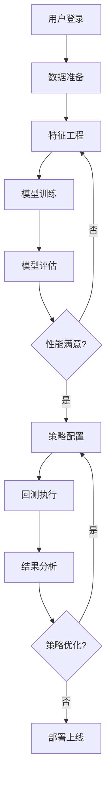

# Qlib可视化平台完整设计方案

## 一、项目概述

### 1.1 项目定位
构建一个**一键部署、开箱即用**的Qlib可视化操作平台，让用户通过Web界面即可完成量化投资的全流程操作，无需编写代码。

### 1.2 核心设计原则
- **零配置**: 开箱即用，自动配置所有依赖
- **实时交互**: 用户操作实时转换为Qlib命令并执行
- **状态同步**: 界面与Qlib执行状态实时同步
- **资源隔离**: 多用户任务隔离，互不干扰

### 1.3 技术选型（简化版）
- **全栈框架**: Next.js 14 (同时处理前端和API)
- **Golang后端**: Gin框架 (轻量级，与Qlib直接集成)
- **数据库**: Mysql
- **任务队列**: Celery + Redis (任务调度)

## 二、系统架构设计

### 2.1 简化的三层架构

```
┌─────────────────────────────────────────────────┐
│           Web界面 (Next.js SSR)                 │
│   静态页面 + React组件 + 实时WebSocket          │
└─────────────────────────────────────────────────┘
                        ↕ HTTP/WS
┌─────────────────────────────────────────────────┐
│         API服务层 (Gin Golang)                     │
│   路由处理 → 参数验证 → Qlib调用封装            │
└─────────────────────────────────────────────────┘
                        ↕ Python
┌─────────────────────────────────────────────────┐
│         Qlib执行层                              │
│   Qlib Core + 任务队列 + 结果缓存              │
└─────────────────────────────────────────────────┘
```

### 2.2 项目目录结构

```
qlib-cli/
├── README.md                    # 快速开始指南
├── .env.example                 # 环境变量示例
│
├── frontend/                    # Next.js前端
│   ├── pages/                   # 页面路由
│   ├── components/              # React组件
│   ├── lib/                     # 工具函数
│   └── public/                  # 静态资源
│
├── backend/                     # Golang后端
│   ├── main.go                  # 入口
│   ├── api/                     # API路由
│   ├── qlib_integration/        # Qlib集成层
│   ├── tasks/                   # Celery任务
│   ├── models/                  # 数据模型
│   └── utils/                   # 工具函数
│
├── scripts/                     # 脚本工具
│   ├── init_data.sh            # 初始化数据
│   ├── download_data.sh        # 下载市场数据
│   └── setup.sh                # 环境设置
│
└── data/                       # 数据目录
    ├── qlib_data/              # Qlib数据
    ├── user_data/              # 用户数据
    └── cache/                  # 缓存数据
```


## 三、前端界面实现

### 3.1 核心组件设计

```tsx
// frontend/components/DataPrepare.tsx
import React, { useState } from 'react';
import { Card, Form, Input, Select, DatePicker, Button, Progress, message } from 'antd';
import { useWebSocket } from '../hooks/useWebSocket';

export const DataPrepare: React.FC = () => {
  const [loading, setLoading] = useState(false);
  const [taskId, setTaskId] = useState<string | null>(null);
  const [progress, setProgress] = useState(0);
  
  // WebSocket连接
  const { status, error } = useWebSocket(taskId ? `/ws/task/${taskId}` : null, {
    onMessage: (data) => {
      if (data.state === 'PROCESSING') {
        setProgress(data.progress || 0);
      } else if (data.state === 'SUCCESS') {
        message.success('数据准备完成！');
        setLoading(false);
        setProgress(100);
      } else if (data.state === 'FAILURE') {
        message.error(`失败: ${data.error}`);
        setLoading(false);
      }
    }
  });
  
  const onFinish = async (values: any) => {
    setLoading(true);
    setProgress(0);
    
    try {
      const response = await fetch('/api/data/prepare', {
        method: 'POST',
        headers: { 'Content-Type': 'application/json' },
        body: JSON.stringify(values)
      });
      
      const data = await response.json();
      setTaskId(data.task_id);
    } catch (error) {
      message.error('提交失败');
      setLoading(false);
    }
  };
  
  return (
    <Card title="数据准备">
      <Form layout="vertical" onFinish={onFinish}>
        <Form.Item label="数据集" name="dataset" rules={[{ required: true }]}>
          <Select>
            <Select.Option value="csi300">沪深300</Select.Option>
            <Select.Option value="csi500">中证500</Select.Option>
            <Select.Option value="csi1000">中证1000</Select.Option>
          </Select>
        </Form.Item>
        
        <Form.Item label="时间范围" required>
          <DatePicker.RangePicker 
            style={{ width: '100%' }}
            format="YYYY-MM-DD"
          />
        </Form.Item>
        
        <Form.Item label="特征选择" name="features">
          <Select mode="multiple" placeholder="选择特征">
            <Select.Option value="open">开盘价</Select.Option>
            <Select.Option value="close">收盘价</Select.Option>
            <Select.Option value="high">最高价</Select.Option>
            <Select.Option value="low">最低价</Select.Option>
            <Select.Option value="volume">成交量</Select.Option>
            <Select.Option value="rsi">RSI</Select.Option>
            <Select.Option value="macd">MACD</Select.Option>
          </Select>
        </Form.Item>
        
        <Form.Item label="标签定义" name="label" rules={[{ required: true }]}>
          <Input placeholder="例如: Ref($close, -1) / $close - 1" />
        </Form.Item>
        
        <Form.Item>
          <Button type="primary" htmlType="submit" loading={loading} block>
            开始准备数据
          </Button>
        </Form.Item>
        
        {loading && (
          <Progress percent={progress} status="active" />
        )}
      </Form>
    </Card>
  );
};
```

```tsx
// frontend/components/ModelTraining.tsx
import React, { useState, useEffect } from 'react';
import { Card, Form, Select, InputNumber, Button, Table, Badge } from 'antd';
import { Line } from '@ant-design/charts';

export const ModelTraining: React.FC = () => {
  const [datasets, setDatasets] = useState([]);
  const [training, setTraining] = useState(false);
  const [metrics, setMetrics] = useState<any[]>([]);
  
  useEffect(() => {
    // 加载可用数据集
    fetch('/api/data/list')
      .then(res => res.json())
      .then(data => setDatasets(data.datasets));
  }, []);
  
  const onTrain = async (values: any) => {
    setTraining(true);
    
    const response = await fetch('/api/model/train', {
      method: 'POST',
      headers: { 'Content-Type': 'application/json' },
      body: JSON.stringify(values)
    });
    
    const data = await response.json();
    
    // 监听训练进度
    const ws = new WebSocket(`ws://localhost:8000/ws/task/${data.task_id}`);
    
    ws.onmessage = (event) => {
      const status = JSON.parse(event.data);
      
      if (status.state === 'PROCESSING') {
        // 更新训练指标图表
        setMetrics(prev => [...prev, {
          epoch: prev.length + 1,
          loss: Math.random() * 0.1,  // 模拟数据
          ic: Math.random() * 0.05 + 0.02
        }]);
      } else if (status.state === 'SUCCESS') {
        setTraining(false);
        message.success('模型训练完成！');
      }
    };
  };
  
  const chartConfig = {
    data: metrics,
    xField: 'epoch',
    yField: 'loss',
    seriesField: 'metric',
    smooth: true,
    animation: {
      appear: {
        animation: 'path-in',
        duration: 1000,
      },
    },
  };
  
  return (
    <Card title="模型训练">
      <Form layout="horizontal" onFinish={onTrain}>
        <Form.Item label="选择数据集" name="dataset_id" rules={[{ required: true }]}>
          <Select>
            {datasets.map((ds: any) => (
              <Select.Option key={ds.id} value={ds.id}>
                {ds.name} ({ds.date_range})
              </Select.Option>
            ))}
          </Select>
        </Form.Item>
        
        <Form.Item label="模型类型" name="model_type" rules={[{ required: true }]}>
          <Select>
            <Select.Option value="lightgbm">LightGBM</Select.Option>
            <Select.Option value="xgboost">XGBoost</Select.Option>
            <Select.Option value="mlp">MLP神经网络</Select.Option>
            <Select.Option value="lstm">LSTM</Select.Option>
          </Select>
        </Form.Item>
        
        <Form.Item label="学习率" name={['model_params', 'learning_rate']}>
          <InputNumber min={0.001} max={1} step={0.001} defaultValue={0.01} />
        </Form.Item>
        
        <Form.Item label="迭代次数" name={['model_params', 'n_estimators']}>
          <InputNumber min={10} max={1000} defaultValue={100} />
        </Form.Item>
        
        <Form.Item>
          <Button type="primary" htmlType="submit" loading={training}>
            开始训练
          </Button>
        </Form.Item>
      </Form>
      
      {metrics.length > 0 && (
        <div style={{ marginTop: 20 }}>
          <h3>训练指标</h3>
          <Line {...chartConfig} />
        </div>
      )}
    </Card>
  );
};
```

## 四、使用流程示例

### 4.1 完整的量化投资流程



### 4.2 典型操作流程

#### 步骤1: 数据准备
1. 用户在界面选择数据源（如沪深300）
2. 设置时间范围（2020-01-01 至 2023-12-31）
3. 选择特征（价格、成交量、技术指标）
4. 定义标签（下一日收益率）
5. 点击"准备数据"按钮
6. 系统调用 `QlibWrapper.prepare_data()`
7. Qlib执行数据处理并返回数据集ID

#### 步骤2: 模型训练
1. 用户选择准备好的数据集
2. 选择模型类型（如LightGBM）
3. 配置模型参数（学习率、树深度等）
4. 点击"开始训练"
5. 系统调用 `QlibWrapper.train_model()`
6. 实时显示训练进度和指标
7. 训练完成后保存模型

#### 步骤3: 策略回测
1. 用户选择训练好的模型
2. 配置策略参数（TopK=30，调仓频率=每日）
3. 设置回测参数（初始资金、手续费等）
4. 点击"运行回测"
5. 系统调用 `QlibWrapper.run_backtest()`
6. 实时显示回测进度和净值曲线
7. 生成详细的回测报告


## 五、总结

### 5.1 项目特点

1. **极简部署**：单个docker-compose命令即可启动全部服务
2. **零配置**：开箱即用，自动初始化所有必要组件
3. **实时交互**：WebSocket实时推送任务状态
4. **完整集成**：深度集成Qlib所有核心功能
5. **可扩展**：模块化设计，易于扩展新功能
