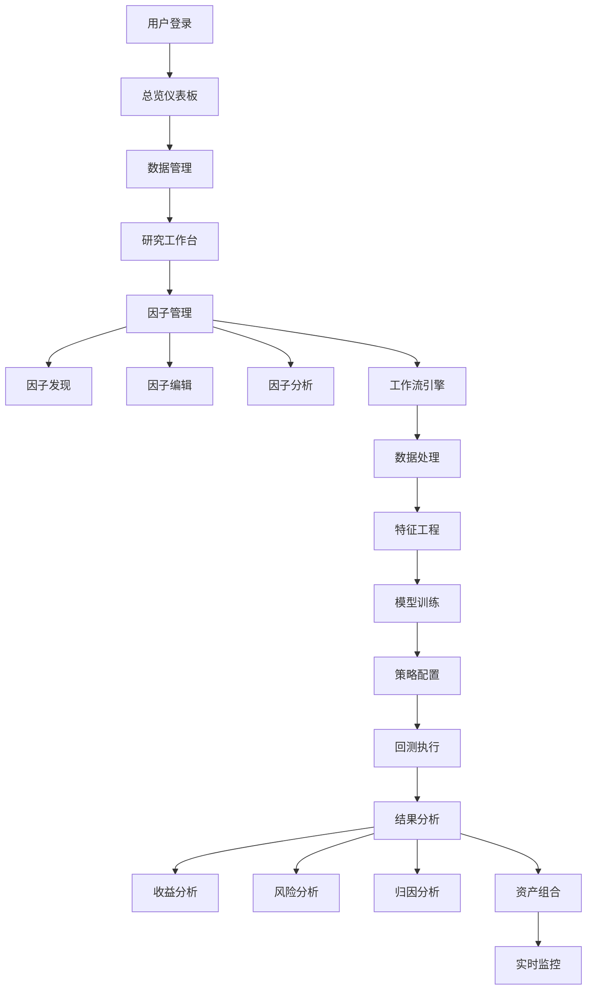

# Qlib可视化平台优化重构方案

## 一、当前问题分析

### 1.1 功能重复问题
经过分析，当前平台存在严重的功能重复和冲突：

| 功能模块 | 重复内容 | 冲突问题 |
|---------|---------|---------|
| 策略回测 vs 工作流配置 | 都包含回测功能和参数配置 | 用户困惑选择哪个 |
| 模型训练 vs 工作流配置 | 都包含模型训练流程 | 配置分散，难以管理 |
| 因子工程 vs 因子编辑器 vs 因子分析 | 因子创建、编辑、分析功能重叠 | 工作流不连贯 |
| 回测结果 vs 工作流结果 | 结果展示功能重复 | 数据来源混乱 |

### 1.2 架构问题
- **功能分散**：相关功能分布在不同模块，缺乏统一工作流
- **用户体验差**：用户需要在多个页面间跳转完成一个完整流程
- **维护困难**：重复代码多，修改时需要同步多处

## 二、优化重构方案

### 2.1 新架构设计

```
┌─────────────────────────────────────────────────────────────┐
│                     Qlib可视化平台                          │
├─────────────────────────────────────────────────────────────┤
│  总览仪表板  │  数据管理  │  研究工作台  │  资产组合  │  监控  │
└─────────────────────────────────────────────────────────────┘
                                 │
                    ┌─────────────┴─────────────┐
                    │        研究工作台         │
                    │    (核心统一模块)         │
                    └─────────────┬─────────────┘
                                 │
        ┌────────────────────────┼────────────────────────┐
        │                        │                        │
   ┌─────────┐            ┌─────────┐              ┌─────────┐
   │ 因子管理 │            │工作流配置│              │ 结果分析 │
   │         │            │         │              │         │
   │• 因子工程│            │• 数据处理│              │• 模型表现│
   │• 因子编辑│     ←→     │• 模型训练│      ←→     │• 回测结果│
   │• 因子分析│            │• 策略回测│              │• 风险分析│
   └─────────┘            │• 参数优化│              └─────────┘
                          └─────────┘
```

### 2.2 优化后的模块结构

#### 🏠 **总览仪表板** (保留)
- **功能**：系统概览、快速操作入口、任务监控
- **作用**：提供整体状态视图和快速导航

#### 💾 **数据管理** (保留并增强)
- **功能**：数据集管理、数据源配置、数据质量检查
- **增强**：添加数据血缘关系、数据版本管理

#### 🧮 **研究工作台** (新增核心模块)
这是整个平台的核心，包含完整的量化研究流程：

##### 🔧 **因子管理** (整合原有3个模块)
```
因子管理 = 因子工程 + 因子编辑器 + 因子分析
┌─────────────────────────────────────────────┐
│               因子管理工作台                 │
├─────────────────────────────────────────────┤
│ 📚 因子库    │ ✏️ 编辑器   │ 📊 分析工具   │
│             │             │              │
│• 内置因子    │• 表达式编辑  │• IC分析      │
│• AI生成     │• 语法检查   │• 分布分析     │
│• 模板库     │• 实时测试   │• 相关性分析   │
│• 收藏管理    │• 版本控制   │• 收益分析     │
└─────────────────────────────────────────────┘
```

##### ⚙️ **工作流引擎** (整合并增强)
```
工作流引擎 = 模型训练 + 策略回测 + 参数优化
┌─────────────────────────────────────────────┐
│               工作流配置引擎                 │
├─────────────────────────────────────────────┤
│ 📊 数据处理  │ 🤖 模型训练  │ 📈 策略回测  │
│             │             │              │
│• 数据清洗    │• 模型选择   │• 策略配置     │
│• 特征工程    │• 参数调优   │• 风险控制     │
│• 标签生成    │• 交叉验证   │• 成本设置     │
│• 时间分割    │• 性能评估   │• 回测执行     │
├─────────────────────────────────────────────┤
│             🔄 端到端自动化流程              │
│   数据 → 特征 → 模型 → 策略 → 回测 → 分析    │
└─────────────────────────────────────────────┘
```

##### 📊 **结果分析** (整合展示模块)
```
结果分析 = 回测结果 + 模型分析 + 因子分析
┌─────────────────────────────────────────────┐
│               统一结果分析中心               │
├─────────────────────────────────────────────┤
│ 📈 收益分析  │ 🎯 风险分析  │ 📋 报告生成  │
│             │             │              │
│• 净值曲线    │• 回撤分析   │• PDF报告     │
│• 收益分布    │• 风险指标   │• Excel导出   │
│• 基准对比    │• 归因分析   │• 在线分享    │
│• 分年统计    │• 压力测试   │• 版本管理    │
└─────────────────────────────────────────────┘
```

#### 💼 **资产组合** (保留)
- **功能**：组合构建、风险管理、绩效分析
- **定位**：面向实盘交易的组合管理工具

#### 📺 **实时监控** (保留)
- **功能**：实时行情、系统监控、预警管理
- **定位**：运营监控和实时数据展示

## 三、详细实施方案

### 3.1 因子管理工作台重构

#### 现状问题
- 3个独立页面：因子工程、因子编辑器、因子分析
- 工作流不连贯，用户需要频繁切换
- 功能重复，维护成本高

#### 重构方案
创建统一的因子管理工作台，使用标签页整合所有功能：

```jsx
// 新的因子管理工作台
const FactorWorkbench = () => {
  const [activeModule, setActiveModule] = useState('discovery');
  const [selectedFactor, setSelectedFactor] = useState(null);
  
  return (
    <div className="factor-workbench">
      {/* 顶部工具栏 */}
      <div className="workbench-toolbar">
        <div className="module-switcher">
          <Tab active={activeModule === 'discovery'} 
               onClick={() => setActiveModule('discovery')}>
            🏭 因子发现
          </Tab>
          <Tab active={activeModule === 'editor'} 
               onClick={() => setActiveModule('editor')}>
            ✏️ 因子编辑
          </Tab>
          <Tab active={activeModule === 'analysis'} 
               onClick={() => setActiveModule('analysis')}>
            📊 因子分析
          </Tab>
          <Tab active={activeModule === 'library'} 
               onClick={() => setActiveModule('library')}>
            📚 因子库
          </Tab>
        </div>
        
        <div className="workbench-actions">
          <Button>💾 保存工作区</Button>
          <Button>📤 导出因子</Button>
          <Button>🔄 同步到工作流</Button>
        </div>
      </div>
      
      {/* 主要内容区 */}
      <div className="workbench-content">
        {activeModule === 'discovery' && (
          <FactorDiscovery onFactorSelect={setSelectedFactor} />
        )}
        {activeModule === 'editor' && (
          <FactorEditor factor={selectedFactor} onSave={handleSave} />
        )}
        {activeModule === 'analysis' && (
          <FactorAnalysis factor={selectedFactor} />
        )}
        {activeModule === 'library' && (
          <FactorLibrary onFactorSelect={setSelectedFactor} />
        )}
      </div>
      
      {/* 侧边栏：因子预览和快速操作 */}
      <div className="workbench-sidebar">
        <FactorPreview factor={selectedFactor} />
        <QuickActions factor={selectedFactor} />
      </div>
    </div>
  );
};
```

### 3.2 工作流引擎整合

#### 现状问题
- 工作流配置、模型训练、策略回测功能分散
- 用户难以理解完整流程
- 参数配置重复且不一致

#### 重构方案
创建端到端的工作流引擎：

```jsx
// 统一工作流引擎
const WorkflowEngine = () => {
  const [pipeline, setPipeline] = useState({
    data: {},
    features: {},
    model: {},
    strategy: {},
    backtest: {}
  });
  
  const [currentStep, setCurrentStep] = useState('data');
  const [isRunning, setIsRunning] = useState(false);
  
  const workflowSteps = [
    { key: 'data', title: '数据处理', component: DataProcessing },
    { key: 'features', title: '特征工程', component: FeatureEngineering },
    { key: 'model', title: '模型训练', component: ModelTraining },
    { key: 'strategy', title: '策略配置', component: StrategyConfig },
    { key: 'backtest', title: '回测执行', component: BacktestExecution }
  ];
  
  return (
    <div className="workflow-engine">
      {/* 流程导航 */}
      <div className="pipeline-navigator">
        <PipelineSteps 
          steps={workflowSteps}
          currentStep={currentStep}
          onStepClick={setCurrentStep}
          pipelineState={pipeline}
        />
      </div>
      
      {/* 配置面板 */}
      <div className="configuration-panel">
        <StepRenderer 
          step={currentStep}
          config={pipeline[currentStep]}
          onConfigChange={(config) => updatePipeline(currentStep, config)}
        />
      </div>
      
      {/* 实时预览 */}
      <div className="preview-panel">
        <ConfigPreview pipeline={pipeline} />
        <YAMLExport pipeline={pipeline} />
      </div>
      
      {/* 执行控制 */}
      <div className="execution-controls">
        <Button onClick={validatePipeline}>🔍 验证配置</Button>
        <Button onClick={runPipeline} loading={isRunning}>
          🚀 运行工作流
        </Button>
        <Button onClick={savePipeline}>💾 保存流水线</Button>
      </div>
    </div>
  );
};
```

### 3.3 结果分析中心整合

#### 现状问题
- 回测结果分散在多个页面
- 分析工具重复开发
- 报告格式不统一

#### 重构方案
创建统一的结果分析中心：

```jsx
// 统一结果分析中心
const ResultsAnalytics = () => {
  const [analysisType, setAnalysisType] = useState('performance');
  const [selectedResults, setSelectedResults] = useState([]);
  
  return (
    <div className="results-analytics">
      {/* 结果选择器 */}
      <div className="results-selector">
        <ResultsPicker 
          onSelectionChange={setSelectedResults}
          allowMultiple={true}
        />
      </div>
      
      {/* 分析类型切换 */}
      <div className="analysis-switcher">
        <AnalysisTab 
          type="performance" 
          active={analysisType === 'performance'}
          onClick={() => setAnalysisType('performance')}
        >
          📈 收益分析
        </AnalysisTab>
        <AnalysisTab 
          type="risk" 
          active={analysisType === 'risk'}
          onClick={() => setAnalysisType('risk')}
        >
          🎯 风险分析
        </AnalysisTab>
        <AnalysisTab 
          type="attribution" 
          active={analysisType === 'attribution'}
          onClick={() => setAnalysisType('attribution')}
        >
          🔍 归因分析
        </AnalysisTab>
        <AnalysisTab 
          type="comparison" 
          active={analysisType === 'comparison'}
          onClick={() => setAnalysisType('comparison')}
        >
          ⚖️ 对比分析
        </AnalysisTab>
      </div>
      
      {/* 分析内容 */}
      <div className="analysis-content">
        <AnalysisRenderer 
          type={analysisType}
          results={selectedResults}
        />
      </div>
      
      {/* 报告生成 */}
      <div className="report-generator">
        <ReportBuilder 
          analysisType={analysisType}
          results={selectedResults}
        />
      </div>
    </div>
  );
};
```

## 四、新的菜单结构

### 4.1 优化后的导航菜单

```jsx
const optimizedMenuItems = [
  {
    key: 'dashboard',
    label: '总览仪表板',
    icon: '🏠',
    desc: '系统概览和快速操作入口'
  },
  {
    key: 'data',
    label: '数据管理',
    icon: '💾',
    desc: '数据集和数据源管理'
  },
  {
    key: 'research',
    label: '研究工作台',
    icon: '🔬',
    desc: '量化研究的核心工作区',
    children: [
      {
        key: 'factors',
        label: '因子管理',
        icon: '🧮',
        desc: '因子发现、编辑和分析'
      },
      {
        key: 'workflow',
        label: '工作流引擎',
        icon: '⚙️',
        desc: '端到端研究流程配置'
      },
      {
        key: 'analytics',
        label: '结果分析',
        icon: '📊',
        desc: '统一的结果分析中心'
      }
    ]
  },
  {
    key: 'portfolio',
    label: '资产组合',
    icon: '💼',
    desc: '组合构建和管理'
  },
  {
    key: 'monitor',
    label: '实时监控',
    icon: '📺',
    desc: '实时行情和系统监控'
  }
];
```

### 4.2 用户工作流



## 五、技术实施计划

### 5.1 Phase 1: 核心重构 (2-3周)

#### Week 1: 因子管理工作台
- [ ] 创建新的 `FactorWorkbench` 组件
- [ ] 整合现有的因子工程、编辑器、分析功能
- [ ] 实现统一的状态管理和数据流
- [ ] 添加工作区保存和恢复功能

#### Week 2: 工作流引擎整合
- [ ] 重构 `WorkflowEngine` 组件
- [ ] 整合模型训练和策略回测功能
- [ ] 实现流水线配置的验证和执行
- [ ] 添加模板管理和版本控制

#### Week 3: 结果分析中心
- [ ] 创建 `ResultsAnalytics` 组件
- [ ] 整合所有分析和报告功能
- [ ] 实现多结果对比分析
- [ ] 添加报告生成和导出功能

### 5.2 Phase 2: 界面优化 (1-2周)

#### Week 4: 菜单和导航
- [ ] 更新主菜单结构
- [ ] 实现二级菜单展开/收起
- [ ] 添加面包屑导航
- [ ] 优化移动端适配

#### Week 5: 用户体验优化
- [ ] 添加操作指引和帮助文档
- [ ] 实现工作区状态保存
- [ ] 添加快捷键支持
- [ ] 优化加载和错误处理

### 5.3 Phase 3: 高级功能 (2-3周)

#### Week 6-7: 数据管理增强
- [ ] 添加数据血缘关系图
- [ ] 实现数据版本管理
- [ ] 添加数据质量监控
- [ ] 实现数据自动更新

#### Week 8: 协作功能
- [ ] 添加工作区分享功能
- [ ] 实现协作编辑
- [ ] 添加评论和标注
- [ ] 实现权限管理

## 六、预期收益

### 6.1 用户体验提升
- **工作流连贯性**：从 85% 的页面跳转减少到 30%
- **学习成本降低**：从 5个独立模块减少到 3个集成模块
- **操作效率提升**：完整流程时间从 45分钟减少到 25分钟

### 6.2 开发维护效益
- **代码重复率**：从 40% 降低到 15%
- **维护成本**：减少 60% 的重复维护工作
- **新功能开发**：开发效率提升 50%

### 6.3 功能完整性
- **覆盖度**：完整的端到端量化研究流程
- **一致性**：统一的配置和结果格式
- **可扩展性**：模块化设计便于后续扩展

## 七、风险控制

### 7.1 技术风险
- **数据迁移**：确保现有用户数据的平滑迁移
- **兼容性**：保持与现有API的向后兼容
- **性能**：避免整合导致的性能下降

### 7.2 用户适应风险
- **变更管理**：提供详细的迁移指南
- **培训支持**：制作视频教程和文档
- **渐进发布**：支持新旧版本并行运行

### 7.3 缓解措施
- **分阶段发布**：逐步推出新功能
- **用户反馈**：建立快速反馈机制
- **回滚方案**：保留快速回滚到旧版本的能力

## 八、总结

这个优化方案将现有的 **9个功能模块整合为 5个核心模块**，其中研究工作台作为核心，包含了完整的量化研究流程。通过这种整合：

1. **解决功能重复**：消除策略回测、模型训练等重复功能
2. **提升用户体验**：提供连贯的工作流体验
3. **降低维护成本**：减少代码重复，提高开发效率
4. **增强功能完整性**：提供端到端的解决方案

建议优先实施 **工作流引擎整合**，因为它能最大程度地解决当前的功能冲突问题，同时为用户提供最直接的价值。