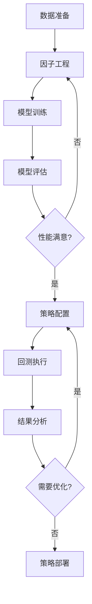

# Qlib 可视化平台

## 📖 项目简介

**Qlib 可视化平台** 是一个基于 Microsoft Qlib 框架构建的端到端量化投资研究平台。通过直观的 Web 界面，用户可以无需编写代码即可完成从数据准备、因子研究、模型训练到策略回测的完整量化投资流程。

### ✨ 核心特性

- 🎯 **零代码操作** - 可视化界面完成所有量化研究工作
- 🔧 **深度集成 Qlib** - 充分利用 Qlib 的强大功能和生态
- 📊 **实时监控** - WebSocket 实时推送任务进度和系统状态
- 🧮 **智能因子工程** - 内置因子库 + 自定义因子编辑器
- 🤖 **多模型支持** - LightGBM、XGBoost、神经网络等
- 📈 **完整回测分析** - 详细的策略表现分析和风险指标
- 🔄 **工作流管理** - 完整的量化研究工作流配置和执行

## 🏗️ 系统架构

### 技术栈

- **前端**: React.js + Ant Design + ECharts
- **后端**: Golang + Gin 框架 + MySQL
- **量化引擎**: Microsoft Qlib
- **实时通信**: WebSocket

### 架构图

```
┌─────────────────────────────────────────────────┐
│           前端界面 (React.js)                   │
│   总览 · 数据管理 · 因子工程 · 模型训练 · 回测   │
└─────────────────────────────────────────────────┘
                        ↕ HTTP/WebSocket
┌─────────────────────────────────────────────────┐
│         后端 API (Golang + Gin)                 │
│   接口路由 · 业务逻辑 · 任务管理 · 实时推送      │
└─────────────────────────────────────────────────┘
                        ↕ Python 调用
┌─────────────────────────────────────────────────┐
│         Qlib 量化引擎                           │
│   数据处理 · 因子计算 · 模型训练 · 策略回测     │
└─────────────────────────────────────────────────┘
                        ↕ 数据存储
┌─────────────────────────────────────────────────┐
│               数据层                            │
│      MySQL 数据库 + Qlib 数据存储               │
└─────────────────────────────────────────────────┘
```

## 📱 功能模块

### 🏠 系统总览
- **实时市场行情**: 沪深300、中证500等主要指数
- **策略表现监控**: 累计收益、夏普比率、最大回撤、胜率
- **系统状态监控**: 数据集状态、模型状态、任务队列
- **快速导航**: 一键跳转到各功能模块

### 💾 数据管理
- **多股票池支持**: CSI300、CSI500、全A股等
- **灵活时间范围**: 自定义数据起止时间
- **数据状态监控**: 实时显示数据准备进度
- **数据质量检查**: 自动检测数据完整性和质量

### 🧮 因子工程
- **内置因子库**: 
  - Alpha158 - qlib 经典158因子
  - Alpha360 - qlib 增强360因子
  - Alpha101 - WorldQuant 101因子
- **自定义因子编辑器**: 
  - 语法高亮和智能提示
  - 实时表达式验证
  - 因子回测和分析
- **因子分析工具**:
  - IC分析、分层回测
  - 因子相关性矩阵
  - 因子覆盖度统计

### 🤖 模型训练
- **多算法支持**:
  - 梯度提升树: LightGBM、XGBoost、CatBoost
  - 神经网络: MLP、LSTM、Transformer
  - 传统方法: 线性回归、逻辑回归
- **超参数调优**: 网格搜索和贝叶斯优化
- **模型评估**: IC、Rank IC、夏普比率等指标
- **训练监控**: 实时显示训练进度和损失曲线

### 📈 策略回测
- **多策略类型**:
  - TopK选股策略
  - 权重分配策略  
  - 增强指数策略
  - 市场中性策略
- **详细配置**:
  - 交易成本设置
  - 仓位管理规则
  - 风险控制参数
- **全面分析**:
  - 净值走势图
  - 回撤分析
  - 持仓分析
  - 行业暴露分析

### ⚙️ Qlib 工作流
- **端到端配置**: 从数据到回测的完整工作流
- **配置预览**: 自动生成 qlib 配置文件
- **一键执行**: 自动执行完整的量化研究流程
- **结果汇总**: 模型性能和策略表现的综合报告

## 🚀 快速开始
### 安装

#### 前端环境

```bash
cd frontend
npm install
npm start
```

#### 后端环境

```bash
# 安装 Golang 依赖
cd backend
go mod download

# 配置数据库
mysql -u root -p < scripts/init.sql

# 启动后端服务
go run main.go
```

#### Qlib 环境

```bash
# 安装 Python 依赖
pip install qlib

# 下载数据
python -c "import qlib; from qlib.data import get_data; get_data('cn_data', './qlib_data')"

# 初始化 qlib
qlib_init --qlib_dir ./qlib_data --region cn
```

## 📋 使用流程

### 完整量化研究流程



### 具体操作步骤

#### 1. 数据准备
1. 进入 **数据管理** 页面
2. 选择股票池（如沪深300）
3. 设置时间范围（如2020-01-01至2023-12-31）
4. 点击"开始准备数据"
5. 等待数据处理完成

#### 2. 因子研究
1. 进入 **因子工程** 页面
2. 选择内置因子库（如Alpha158）或创建自定义因子
3. 使用因子编辑器编写因子表达式
4. 运行因子回测验证效果
5. 保存有效因子

#### 3. 模型训练
1. 进入 **模型训练** 页面
2. 选择已准备的数据集
3. 选择模型类型（如LightGBM）
4. 配置模型参数
5. 开始训练并监控进度

#### 4. 策略回测
1. 进入 **策略回测** 页面
2. 选择训练好的模型
3. 配置策略参数（TopK、调仓频率等）
4. 设置交易成本
5. 运行回测并查看结果

#### 5. 完整工作流
1. 进入 **Qlib工作流** 页面
2. 按步骤配置：数据→特征→模型→策略→回测
3. 预览生成的qlib配置文件
4. 一键运行完整工作流
5. 查看综合分析报告

## 📊 API 接口文档

### 基础响应格式

```json
{
  "code": 0,
  "message": "success",
  "data": {...},
  "total": 100
}
```

### 主要接口

- `GET /api/v1/datasets` - 获取数据集列表
- `POST /api/v1/datasets` - 创建数据集
- `GET /api/v1/factors` - 获取因子列表
- `POST /api/v1/factors/test` - 测试因子表现
- `POST /api/v1/models/train` - 训练模型
- `GET /api/v1/models/{id}/metrics` - 获取模型指标
- `POST /api/v1/backtests/run` - 运行回测
- `GET /api/v1/backtests/{id}/results` - 获取回测结果
- `WS /ws/tasks/{taskId}` - 任务进度WebSocket

详细API文档请参考：[API规范文档](./golang-backend-api-spec.md)

## 🔧 配置说明

### 环境变量

```bash
# 数据库配置
DB_HOST=localhost
DB_PORT=3306
DB_USER=root
DB_PASSWORD=password
DB_NAME=qlib_platform

# Qlib配置
QLIB_DATA_PATH=./qlib_data
QLIB_PYTHON_PATH=/usr/bin/python3

# 服务配置
SERVER_PORT=8080
FRONTEND_URL=http://localhost:3000
```

### Qlib配置

```yaml
# qlib_config.yaml
qlib_init:
  provider_uri: ~/.qlib/qlib_data/cn_data
  region: cn
  
market: csi300
benchmark: SH000300

data_handler_config:
  start_time: 2018-01-01
  end_time: 2023-12-31
  instruments: market
```

## 📈 性能优化

### 系统优化建议

1. **内存配置**: 建议至少8GB内存，大数据集需要16GB+
2. **存储优化**: 使用SSD存储提升数据读取速度
3. **并行计算**: 配置多核CPU加速模型训练
4. **缓存策略**: 启用Redis缓存常用计算结果
5. **数据库优化**: 为查询频繁的字段添加索引

### 网络优化

```nginx
# nginx.conf
server {
    listen 80;
    server_name your-domain.com;
    
    # 前端静态文件
    location / {
        root /var/www/qlib-platform;
        try_files $uri $uri/ /index.html;
    }
    
    # 后端API代理
    location /api/ {
        proxy_pass http://localhost:8080;
        proxy_set_header Host $host;
        proxy_set_header X-Real-IP $remote_addr;
    }
    
    # WebSocket代理
    location /ws/ {
        proxy_pass http://localhost:8080;
        proxy_http_version 1.1;
        proxy_set_header Upgrade $http_upgrade;
        proxy_set_header Connection "upgrade";
    }
}
```

## 🐛 常见问题

### Q: 数据准备失败怎么办？

**A**: 检查以下几点：
1. Qlib数据是否正确下载和初始化
2. 时间范围是否在数据覆盖范围内
3. 磁盘空间是否充足
4. Python环境是否正确配置

### Q: 模型训练时间过长？

**A**: 优化建议：
1. 减少特征数量或缩短训练时间范围
2. 调整模型参数（减少树的数量或深度）
3. 使用更快的算法（如LinearRegression）
4. 增加CPU核数或使用GPU加速

### Q: 回测结果不合理？

**A**: 请检查：
1. 交易成本设置是否合理
2. 数据是否存在未来函数
3. 策略参数是否过于激进
4. 基准指数是否正确

### Q: WebSocket连接失败？

**A**: 解决方案：
1. 检查防火墙设置
2. 确认WebSocket端口是否开放
3. 查看浏览器控制台错误信息
4. 检查后端服务状态

## 🔒 安全说明

### 数据安全

- 所有数据存储在本地，不会上传到外部服务器
- 支持数据库加密和访问控制
- 定期备份重要数据

### 访问控制

- JWT Token认证机制
- 基于角色的权限管理
- API访问频率限制
- 请求日志记录

## 代码规范

- 前端代码遵循ESLint规范
- 后端代码遵循Go官方规范
- 提交信息使用约定式提交格式
- 添加充分的单元测试

## 📄 许可证

本项目采用 MIT 许可证 - 详见 [LICENSE](LICENSE) 文件

## 🙏 致谢

- **Microsoft Qlib** - 提供强大的量化投资框架
- **Ant Design** - 优秀的React UI组件库
- **ECharts** - 专业的数据可视化图表库
- **Gin Framework** - 高性能的Go Web框架

## 📞 联系我们

- **项目地址**: https://github.com/your-org/qlib-design
- **文档网站**: https://qlib-platform.docs.com
- **问题反馈**: https://github.com/your-org/qlib-design/issues

---

*如果这个项目对您有帮助，请给我们一个 ⭐ Star！*